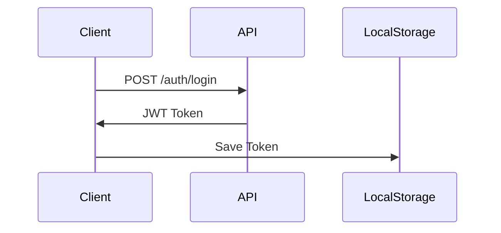
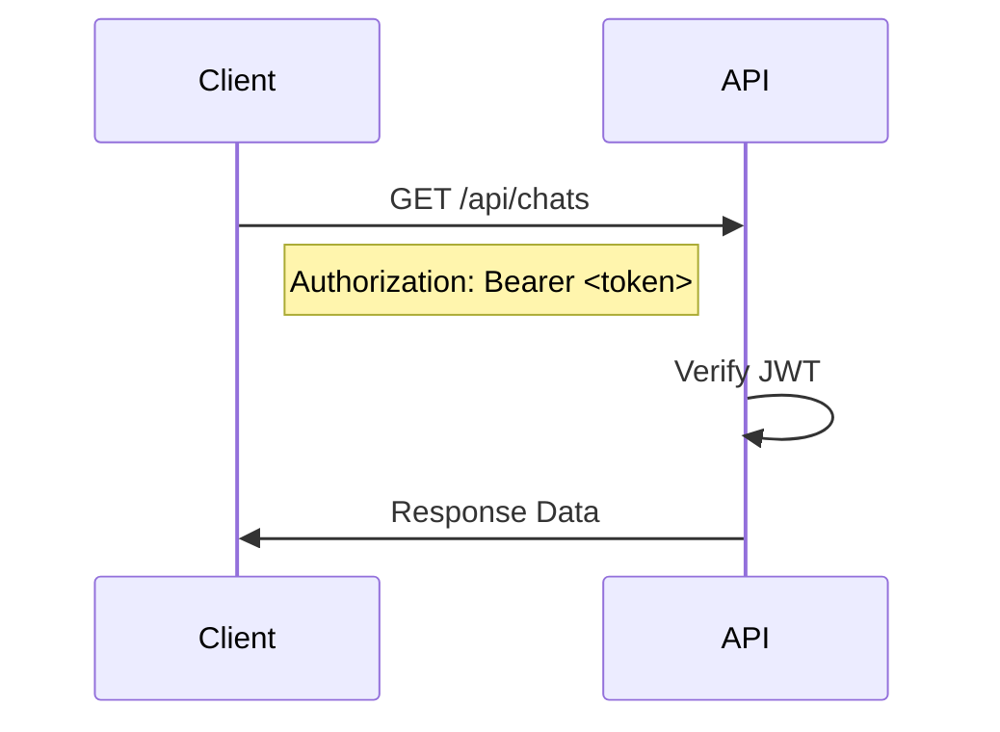
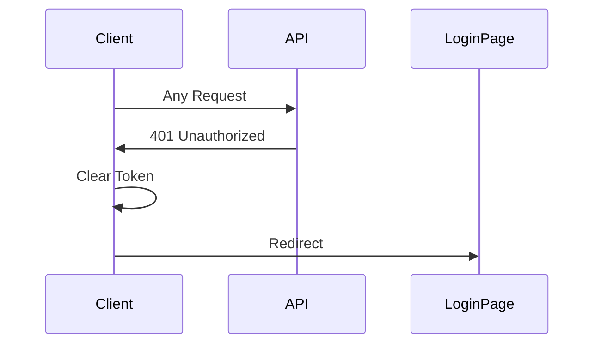

# 🔌 Lion Rocket API Documentation Index

## API 개요

Lion Rocket API는 RESTful 원칙을 따르며, JWT Bearer 토큰을 사용한 인증을 제공합니다.

### Base URLs
- **Development**: `http://localhost:8000`
- **Production**: `https://api.lionrocket.com`

### 인증 방식
```http
Authorization: Bearer <JWT_TOKEN>
```

---

## 📑 API 카테고리별 인덱스

### 1. 🔐 인증 API (`/auth`)

인증 관련 엔드포인트로 JWT 토큰 발급 및 사용자 관리를 담당합니다.

| Endpoint | Method | 설명 | Request Body | Response |
|----------|--------|------|--------------|----------|
| `/auth/register` | POST | 새 사용자 등록 | `username`, `email`, `password` | User object |
| `/auth/login` | POST | 로그인 및 JWT 토큰 발급 | `username`, `password` | JWT token + User |
| `/auth/logout` | POST | 로그아웃 | - | Success message |
| `/auth/me` | GET | 현재 사용자 정보 | - | User object |

#### 예시: 회원가입
```bash
curl -X POST http://localhost:8000/auth/register \
  -H "Content-Type: application/json" \
  -d '{
    "username": "testuser",
    "email": "test@example.com",
    "password": "Test123!@#"
  }'
```

#### 예시: 로그인
```bash
curl -X POST http://localhost:8000/auth/login \
  -H "Content-Type: application/x-www-form-urlencoded" \
  -d "username=testuser&password=Test123!@#"
```

### 2. 💬 채팅 API (`/api/chats`)

채팅 세션 및 메시지 관리를 담당합니다.

| Endpoint | Method | 설명 | Auth | Params |
|----------|--------|------|------|--------|
| `/api/chats` | GET | 채팅 목록 조회 | ✅ | `page`, `limit` |
| `/api/chats` | POST | 새 채팅 생성 | ✅ | `character_id` |
| `/api/chats/{id}` | GET | 채팅 상세 조회 | ✅ | - |
| `/api/chats/{id}` | DELETE | 채팅 삭제 | ✅ | - |
| `/api/chats/{id}/messages` | GET | 메시지 목록 | ✅ | `page`, `limit` |
| `/api/chats/{id}/messages` | POST | 메시지 전송 | ✅ | `content` (max 200자) |

#### 메시지 전송 예시
```bash
curl -X POST http://localhost:8000/api/chats/1/messages \
  -H "Authorization: Bearer <JWT_TOKEN>" \
  -H "Content-Type: application/json" \
  -d '{
    "content": "안녕하세요, Claude!"
  }'
```

### 3. 🎭 캐릭터 API (`/api/characters`)

AI 캐릭터 관리 기능을 제공합니다.

| Endpoint | Method | 설명 | Auth | Admin Only |
|----------|--------|------|------|------------|
| `/api/characters` | GET | 캐릭터 목록 | ✅ | ❌ |
| `/api/characters` | POST | 캐릭터 생성 | ✅ | ✅ |
| `/api/characters/{id}` | PUT | 캐릭터 수정 | ✅ | ✅ |
| `/api/characters/{id}` | DELETE | 캐릭터 삭제 | ✅ | ✅ |

### 4. 📋 프롬프트 API (`/api/prompts`)

공용 프롬프트 관리 기능입니다.

| Endpoint | Method | 설명 | Auth | Admin Only |
|----------|--------|------|------|------------|
| `/api/prompts` | GET | 프롬프트 목록 | ✅ | ❌ |
| `/api/prompts` | POST | 프롬프트 생성 | ✅ | ✅ |
| `/api/prompts/{id}` | PUT | 프롬프트 수정 | ✅ | ✅ |
| `/api/prompts/{id}` | DELETE | 프롬프트 삭제 | ✅ | ✅ |

### 5. 👨‍💼 관리자 API (`/admin`)

관리자 전용 기능을 제공합니다.

| Endpoint | Method | 설명 | Auth |
|----------|--------|------|------|
| `/admin/users` | GET | 사용자 목록 | ✅ Admin |
| `/admin/users/{id}/chats` | GET | 사용자별 채팅 기록 | ✅ Admin |
| `/admin/users/{id}/usage` | GET | 사용자별 사용량 통계 | ✅ Admin |
| `/admin/stats/overview` | GET | 전체 시스템 통계 | ✅ Admin |

---

## 📊 응답 형식

### 성공 응답
```json
{
  "data": { ... },
  "message": "Success",
  "status": 200
}
```

### 페이지네이션 응답
```json
{
  "items": [ ... ],
  "total": 100,
  "page": 1,
  "pages": 5,
  "limit": 20
}
```

### 에러 응답
```json
{
  "detail": "Error message",
  "status": 400
}
```

---

## 🔒 인증 플로우

### 1. 토큰 획득


### 2. 인증된 요청


### 3. 토큰 만료 처리


---

## 🚦 상태 코드

| Code | 의미 | 설명 |
|------|------|------|
| 200 | OK | 요청 성공 |
| 201 | Created | 리소스 생성 성공 |
| 204 | No Content | 삭제 성공 |
| 400 | Bad Request | 잘못된 요청 |
| 401 | Unauthorized | 인증 필요 |
| 403 | Forbidden | 권한 없음 |
| 404 | Not Found | 리소스 없음 |
| 429 | Too Many Requests | Rate limit 초과 |
| 500 | Internal Server Error | 서버 오류 |

---

## ⚡ Rate Limiting

| 사용자 유형 | 제한 |
|------------|------|
| 일반 사용자 | 100 requests/minute |
| 채팅 메시지 | 20 messages/minute |
| 관리자 | 200 requests/minute |

---

## 🧪 API 테스트

### Swagger UI
- URL: http://localhost:8000/docs
- 인터랙티브 API 문서 및 테스트

### ReDoc
- URL: http://localhost:8000/redoc
- 읽기 전용 API 문서

### Postman Collection
- [다운로드 링크] (준비 중)

---

## 🔄 버전 관리

| Version | Release Date | Changes |
|---------|--------------|---------|
| v1.0.0 | 2024-12-01 | 초기 릴리스 |

---

## 📝 참고 사항

1. 모든 날짜/시간은 UTC 기준
2. 문자열 인코딩은 UTF-8
3. 요청 본문은 JSON 형식 (로그인 제외)
4. 파일 업로드는 multipart/form-data

---

*자세한 API 명세는 [API_SPECIFICATION.md](API_SPECIFICATION.md) 참조*