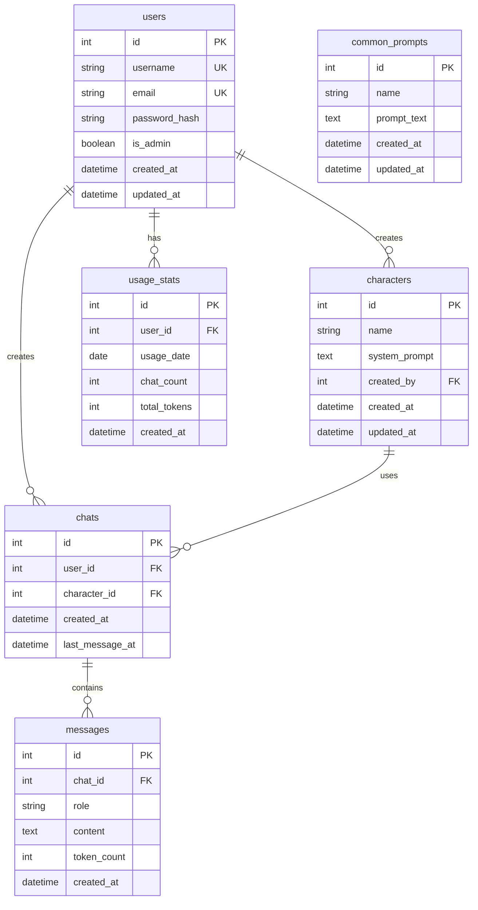

# AI Chat Service Architecture Design

## 프로젝트 개요
Claude API를 활용한 AI 채팅 서비스로, 사용자별 캐릭터 기반 대화 및 관리자 대시보드를 포함한 풀스택 웹 애플리케이션

## 시스템 아키텍처

### 1. 기술 스택
- **Frontend**: Vue 3 + Pinia + Tailwind CSS + Axios
- **Backend**: FastAPI + SQLAlchemy + Anthropic Claude API
- **Database**: SQLite
- **Container**: Docker + Docker Compose
- **Authentication**: JWT (JSON Web Tokens)

### 2. 폴더 구조
```
lionrocket/
├── frontend/                 # Vue 3 프론트엔드
│   ├── src/
│   │   ├── views/           # 페이지 컴포넌트
│   │   ├── components/      # 재사용 컴포넌트
│   │   ├── stores/          # Pinia 상태 관리
│   │   ├── composables/     # Vue 컴포저블
│   │   ├── api/             # API 클라이언트
│   │   └── router/          # Vue Router 설정
│   ├── Dockerfile
│   └── package.json
├── backend/                  # FastAPI 백엔드
│   ├── app/
│   │   ├── api/             # API 엔드포인트
│   │   ├── models/          # SQLAlchemy 모델
│   │   ├── schemas/         # Pydantic 스키마
│   │   ├── services/        # 비즈니스 로직
│   │   ├── auth/            # 인증 관련
│   │   └── config.py        # 설정 파일
│   ├── Dockerfile
│   └── requirements.txt
├── docker-compose.yml        # Docker 구성
├── .env.example             # 환경변수 예시
└── README.md
```

## 데이터베이스 설계

### ER 다이어그램


## API 설계

### 인증 엔드포인트
```
POST   /auth/register     # 회원가입
POST   /auth/login        # 로그인
POST   /auth/logout       # 로그아웃
GET    /auth/me           # 현재 사용자 정보
```

### 채팅 엔드포인트
```
GET    /api/chats         # 채팅 목록 조회
POST   /api/chats         # 새 채팅 생성
GET    /api/chats/{id}    # 특정 채팅 조회
DELETE /api/chats/{id}    # 채팅 삭제

POST   /api/chats/{id}/messages    # 메시지 전송
GET    /api/chats/{id}/messages    # 메시지 목록 조회
```

### 캐릭터 관리 엔드포인트
```
GET    /api/characters    # 캐릭터 목록 조회
POST   /api/characters    # 캐릭터 생성
PUT    /api/characters/{id}    # 캐릭터 수정
DELETE /api/characters/{id}    # 캐릭터 삭제
```

### 프롬프트 관리 엔드포인트
```
GET    /api/prompts       # 공용 프롬프트 목록
POST   /api/prompts       # 프롬프트 생성
PUT    /api/prompts/{id}  # 프롬프트 수정
DELETE /api/prompts/{id}  # 프롬프트 삭제
```

### 관리자 전용 엔드포인트
```
GET    /admin/users       # 사용자 목록 조회
GET    /admin/users/{id}/chats     # 특정 사용자 채팅 기록
GET    /admin/users/{id}/usage     # 특정 사용자 사용량
GET    /admin/stats/overview       # 전체 통계 개요
```

## Frontend 아키텍처

### 주요 화면
1. **로그인/회원가입 페이지**
   - JWT 토큰 기반 인증
   - 폼 유효성 검사

2. **메인 채팅 화면**
   - 좌측: 채팅 목록 및 캐릭터 선택
   - 중앙: 채팅 인터페이스
   - 우측: 캐릭터 정보 및 설정

3. **관리자 대시보드**
   - 사용자 관리 탭
   - 채팅 기록 조회 탭
   - 사용량 통계 탭 (차트 포함)

### Pinia Store 구조
```javascript
// authStore
- state: user, token, isAuthenticated
- actions: login(), logout(), register()

// chatStore  
- state: chats, currentChat, messages
- actions: loadChats(), sendMessage(), createChat()

// adminStore
- state: users, statistics, selectedUser
- actions: loadUsers(), loadUserStats(), loadUserChats()
```

## Backend 아키텍처

### 주요 서비스
1. **AuthService**
   - JWT 토큰 생성/검증
   - 비밀번호 해싱 (bcrypt)
   - 사용자 권한 확인

2. **ChatService**
   - Claude API 통합
   - 메시지 200자 제한 처리
   - 토큰 사용량 계산

3. **StatsService**
   - 일별 사용량 집계
   - 통계 데이터 생성

### Claude API 통합
```python
# 메시지 처리 플로우
1. 사용자 메시지 수신 (200자 제한)
2. 캐릭터 프롬프트 + 공용 프롬프트 조합
3. Claude API 호출
4. 응답 저장 및 토큰 계산
5. 사용량 통계 업데이트
```

## 보안 설계

### 인증 및 권한
- JWT 기반 무상태 인증
- 관리자 권한은 `is_admin` 플래그로 구분
- API 엔드포인트별 권한 검사 미들웨어

### 데이터 보호
- 비밀번호 bcrypt 해싱
- 환경변수를 통한 민감 정보 관리
- CORS 설정으로 허용된 도메인만 접근

### API 보안
- Rate limiting (채팅 요청 제한)
- Input validation (Pydantic)
- SQL Injection 방지 (SQLAlchemy ORM)

## Docker 구성

### docker-compose.yml
```yaml
version: '3.8'

services:
  frontend:
    build: ./frontend
    ports:
      - "8080:8080"
    environment:
      - VUE_APP_API_URL=http://localhost:8000
    depends_on:
      - backend

  backend:
    build: ./backend
    ports:
      - "8000:8000"
    environment:
      - DATABASE_URL=sqlite:///./data/app.db
      - CLAUDE_API_KEY=${CLAUDE_API_KEY}
      - JWT_SECRET=${JWT_SECRET}
    volumes:
      - ./data:/app/data

  nginx:
    image: nginx:alpine
    ports:
      - "80:80"
    volumes:
      - ./nginx.conf:/etc/nginx/nginx.conf
    depends_on:
      - frontend
      - backend
```

## 환경변수 설정

### .env 파일
```env
# Claude API
CLAUDE_API_KEY=your_claude_api_key_here

# JWT
JWT_SECRET=your_jwt_secret_key_here
JWT_ALGORITHM=HS256
JWT_EXPIRATION_HOURS=24

# Database
DATABASE_URL=sqlite:///./data/app.db

# App
APP_ENV=development
DEBUG=true
```

## 성능 최적화

### Frontend
- 컴포넌트 lazy loading
- Pinia store 상태 최적화
- 채팅 메시지 가상 스크롤링

### Backend
- 데이터베이스 인덱싱 (user_id, chat_id)
- API 응답 캐싱
- 비동기 처리 (async/await)

### Infrastructure
- Nginx 리버스 프록시
- 정적 파일 캐싱
- Gzip 압축

## 배포 고려사항

### 개발 환경
```bash
# Frontend 실행
cd frontend && npm run dev

# Backend 실행
cd backend && uvicorn app.main:app --reload

# Docker 실행
docker-compose up
```

### 프로덕션 체크리스트
- [ ] 환경변수 보안 설정
- [ ] HTTPS 설정
- [ ] 데이터베이스 백업 전략
- [ ] 로그 수집 및 모니터링
- [ ] 에러 추적 시스템
- [ ] CI/CD 파이프라인

## 확장 가능성

### 향후 기능 추가
1. 실시간 채팅 (WebSocket)
2. 파일 업로드 지원
3. 멀티 언어 지원
4. 채팅 내보내기 기능
5. 고급 통계 및 분석

### 스케일링 전략
1. SQLite → PostgreSQL 마이그레이션
2. Redis 캐싱 레이어
3. 로드 밸런서 구성
4. 마이크로서비스 분리