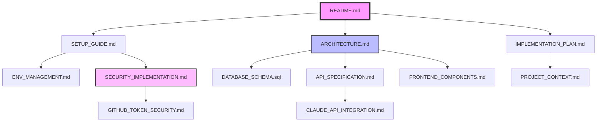

# 📍 Lion Rocket Documentation Map

## 🗺️ 문서 네비게이션 구조

```
📚 Lion Rocket Documentation
│
├── 🏠 시작하기
│   ├── README.md ─────────────► 프로젝트 소개
│   ├── SETUP_GUIDE.md ────────► 설치 가이드
│   └── ENV_MANAGEMENT.md ─────► 환경설정
│
├── 🏗️ 아키텍처
│   ├── ARCHITECTURE.md ───────► 시스템 설계
│   ├── DATABASE_SCHEMA.sql ───► DB 구조
│   └── PROJECT_CONTEXT.md ────► 프로젝트 현황
│
├── 🔌 API & 기능
│   ├── API_SPECIFICATION.md ──► API 명세
│   ├── API_INDEX.md ──────────► API 인덱스
│   ├── CLAUDE_API_INTEGRATION.md ► AI 통합
│   └── FRONTEND_COMPONENTS.md ─► Vue 컴포넌트
│
├── 🔒 보안
│   ├── SECURITY_IMPLEMENTATION.md ► 보안 구현
│   └── GITHUB_TOKEN_SECURITY.md ► 토큰 관리
│
├── 📋 개발
│   ├── IMPLEMENTATION_PLAN.md ─► 개발 계획
│   └── PROJECT_INDEX.md ──────► 전체 인덱스
│
└── 📁 코드베이스
    ├── backend/ ──────────────► FastAPI
    ├── frontend/ ─────────────► Vue 3
    └── docker-compose.yml ────► Docker
```

---

## 🎯 목적별 문서 가이드

### 👋 처음 시작하는 경우
1. **[README.md](README.md)** - 프로젝트 개요 파악
2. **[SETUP_GUIDE.md](SETUP_GUIDE.md)** - 개발 환경 설정
3. **[ENV_MANAGEMENT.md](ENV_MANAGEMENT.md)** - 환경변수 설정

### 🏗️ 아키텍처 이해
1. **[ARCHITECTURE.md](ARCHITECTURE.md)** - 전체 시스템 구조
2. **[DATABASE_SCHEMA.sql](DATABASE_SCHEMA.sql)** - 데이터베이스 설계
3. **[PROJECT_CONTEXT.md](PROJECT_CONTEXT.md)** - 현재 구현 상태

### 🔧 개발 작업
1. **[API_SPECIFICATION.md](API_SPECIFICATION.md)** - API 엔드포인트 명세
2. **[FRONTEND_COMPONENTS.md](FRONTEND_COMPONENTS.md)** - Vue 컴포넌트 구조
3. **[CLAUDE_API_INTEGRATION.md](CLAUDE_API_INTEGRATION.md)** - AI 기능 통합

### 🔐 보안 관련
1. **[SECURITY_IMPLEMENTATION.md](SECURITY_IMPLEMENTATION.md)** - JWT 인증 및 보안
2. **[GITHUB_TOKEN_SECURITY.md](GITHUB_TOKEN_SECURITY.md)** - 토큰 보안 가이드

---

## 📊 문서 관계도



---

## 🔍 빠른 참조

### 코드 위치
| 기능 | 파일 경로 |
|------|----------|
| JWT 인증 | `backend/app/auth/jwt.py` |
| API 라우터 | `backend/app/auth/router.py` |
| 데이터 모델 | `backend/app/models.py` |
| Vue 라우터 | `frontend/src/router/index.ts` |
| Pinia Store | `frontend/src/stores/auth.ts` |
| 로그인 페이지 | `frontend/src/views/LoginView.vue` |

### 환경변수
| 변수명 | 용도 | 파일 |
|--------|------|------|
| `JWT_SECRET` | JWT 서명 키 | `.env` |
| `CLAUDE_API_KEY` | Claude API | `.env` |
| `DATABASE_URL` | DB 연결 | `.env` |

### API 엔드포인트
| 기능 | 엔드포인트 | 문서 |
|------|-----------|------|
| 인증 | `/auth/*` | [API_INDEX.md](API_INDEX.md) |
| 채팅 | `/api/chats/*` | [API_SPECIFICATION.md](API_SPECIFICATION.md) |
| 관리자 | `/admin/*` | [API_SPECIFICATION.md](API_SPECIFICATION.md) |

---

## 📝 문서 업데이트 가이드

### 새 문서 추가 시
1. 적절한 카테고리에 배치
2. `PROJECT_INDEX.md`에 링크 추가
3. 이 파일의 네비게이션 구조 업데이트

### 문서 수정 시
1. 관련된 다른 문서도 함께 확인
2. 버전 정보 업데이트 (필요시)
3. 변경 이력 기록

---

## 🏷️ 문서 태그

- 🚀 **시작하기**: 초보자용 문서
- 🏗️ **아키텍처**: 시스템 설계 관련
- 🔌 **API**: API 관련 문서
- 🔒 **보안**: 보안 관련 문서
- 📋 **개발**: 개발 가이드
- 🧪 **테스트**: 테스트 관련
- 🐳 **배포**: 배포 및 운영

---

*Last Updated: 2024년 12월*