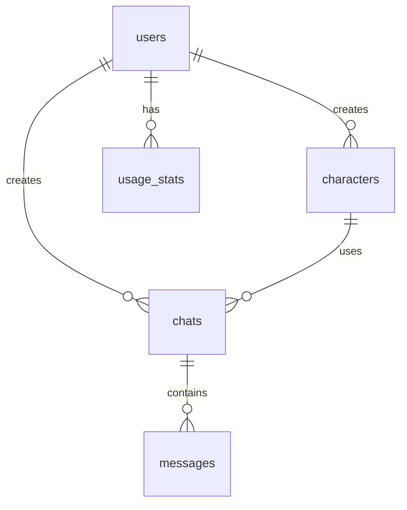

# 🚀 Lion Rocket AI Chat - Project Index

## 📋 프로젝트 개요

Lion Rocket은 Anthropic의 Claude API를 활용한 AI 채팅 서비스입니다. JWT 인증을 사용하며, Vue 3와 FastAPI로 구축되었습니다.

### 주요 특징
- 🔐 JWT 기반 인증 시스템
- 🤖 Claude AI 채팅 기능
- 👤 캐릭터 기반 대화
- 📊 사용량 추적 및 통계
- 👨‍💼 관리자 대시보드
- 🐳 Docker 기반 배포

---

## 📁 프로젝트 구조

```
lionrocket/
├── 📂 backend/                # FastAPI 백엔드
│   └── app/
│       ├── auth/             # JWT 인증 모듈
│       │   ├── jwt.py       # 토큰 생성/검증
│       │   ├── router.py    # 인증 엔드포인트
│       │   └── dependencies.py # 인증 미들웨어
│       ├── main.py          # FastAPI 앱 진입점
│       ├── models.py        # SQLAlchemy 모델
│       ├── schemas.py       # Pydantic 스키마
│       └── database.py      # 데이터베이스 설정
│
├── 📂 frontend/              # Vue 3 프론트엔드
│   ├── src/
│   │   ├── views/           # 페이지 컴포넌트
│   │   │   ├── LoginView.vue
│   │   │   ├── RegisterView.vue
│   │   │   ├── ChatView.vue
│   │   │   └── AdminDashboard.vue
│   │   ├── stores/          # Pinia 상태 관리
│   │   │   └── auth.ts
│   │   ├── router/          # Vue Router
│   │   │   └── index.ts
│   │   ├── utils/           # 유틸리티
│   │   │   └── auth.ts
│   │   └── types/           # TypeScript 타입
│   │       └── index.ts
│   ├── vite.config.ts       # Vite 설정
│   └── package.json         # 의존성
│
├── 📂 nginx/                 # Nginx 설정
│   └── nginx.conf
│
├── 📄 docker-compose.yml     # Docker 구성
├── 📄 .env.example          # 환경변수 템플릿
└── 📄 DATABASE_SCHEMA.sql   # DB 스키마
```

---

## 📚 문서 인덱스

### 1. 시작하기
- 📖 [README.md](README.md) - 프로젝트 소개 및 JWT 인증 시스템
- 🚀 [SETUP_GUIDE.md](SETUP_GUIDE.md) - 설치 및 설정 가이드
- 🌍 [ENV_MANAGEMENT.md](ENV_MANAGEMENT.md) - 환경변수 관리 가이드

### 2. 아키텍처 및 설계
- 🏗️ [ARCHITECTURE.md](ARCHITECTURE.md) - 시스템 아키텍처 설계
- 🗄️ [DATABASE_SCHEMA.sql](DATABASE_SCHEMA.sql) - 데이터베이스 스키마
- 📋 [PROJECT_CONTEXT.md](PROJECT_CONTEXT.md) - 프로젝트 컨텍스트

### 3. API 및 기능
- 🔌 [API_SPECIFICATION.md](API_SPECIFICATION.md) - RESTful API 명세서
- 🤖 [CLAUDE_API_INTEGRATION.md](CLAUDE_API_INTEGRATION.md) - Claude API 통합 가이드
- 🎨 [FRONTEND_COMPONENTS.md](FRONTEND_COMPONENTS.md) - Vue 컴포넌트 구조

### 4. 보안 및 운영
- 🔒 [SECURITY_IMPLEMENTATION.md](SECURITY_IMPLEMENTATION.md) - 보안 구현 상세
- 🔑 [GITHUB_TOKEN_SECURITY.md](GITHUB_TOKEN_SECURITY.md) - GitHub 토큰 보안 가이드

### 5. 개발 계획
- 📅 [IMPLEMENTATION_PLAN.md](IMPLEMENTATION_PLAN.md) - 단계별 구현 계획

---

## 🔗 주요 API 엔드포인트

### 인증 (Authentication)
| Method | Endpoint | 설명 | 인증 필요 |
|--------|----------|------|-----------|
| POST | `/auth/register` | 회원가입 | ❌ |
| POST | `/auth/login` | 로그인 (JWT 발급) | ❌ |
| POST | `/auth/logout` | 로그아웃 | ✅ |
| GET | `/auth/me` | 현재 사용자 정보 | ✅ |

### 채팅 (Chat)
| Method | Endpoint | 설명 | 인증 필요 |
|--------|----------|------|-----------|
| GET | `/api/chats` | 채팅 목록 조회 | ✅ |
| POST | `/api/chats` | 새 채팅 생성 | ✅ |
| GET | `/api/chats/{id}` | 채팅 상세 조회 | ✅ |
| DELETE | `/api/chats/{id}` | 채팅 삭제 | ✅ |
| POST | `/api/chats/{id}/messages` | 메시지 전송 | ✅ |
| GET | `/api/chats/{id}/messages` | 메시지 목록 | ✅ |

### 캐릭터 (Characters)
| Method | Endpoint | 설명 | 인증 필요 |
|--------|----------|------|-----------|
| GET | `/api/characters` | 캐릭터 목록 | ✅ |
| POST | `/api/characters` | 캐릭터 생성 | ✅ Admin |
| PUT | `/api/characters/{id}` | 캐릭터 수정 | ✅ Admin |
| DELETE | `/api/characters/{id}` | 캐릭터 삭제 | ✅ Admin |

### 관리자 (Admin)
| Method | Endpoint | 설명 | 인증 필요 |
|--------|----------|------|-----------|
| GET | `/admin/users` | 사용자 목록 | ✅ Admin |
| GET | `/admin/users/{id}/chats` | 사용자 채팅 기록 | ✅ Admin |
| GET | `/admin/users/{id}/usage` | 사용자 사용량 | ✅ Admin |
| GET | `/admin/stats/overview` | 전체 통계 | ✅ Admin |

---

## 🛠️ 기술 스택

### Backend
- **Framework**: FastAPI (Python 3.10+)
- **Database**: PostgreSQL / SQLite
- **ORM**: SQLAlchemy
- **Authentication**: JWT (python-jose)
- **AI**: Anthropic Claude API
- **Password Hashing**: bcrypt
- **Validation**: Pydantic

### Frontend
- **Framework**: Vue 3 (Composition API)
- **Language**: TypeScript
- **Build Tool**: Vite
- **State Management**: Pinia
- **Router**: Vue Router 4
- **HTTP Client**: Axios
- **UI Components**: (Tailwind CSS 예정)

### DevOps
- **Container**: Docker & Docker Compose
- **Web Server**: Nginx
- **Version Control**: Git

---

## 📊 데이터베이스 구조

### 테이블 관계도


### 주요 테이블
1. **users** - 사용자 정보 (JWT 인증)
2. **characters** - AI 캐릭터 설정
3. **chats** - 채팅 세션
4. **messages** - 대화 메시지
5. **usage_stats** - 사용량 통계
6. **common_prompts** - 공용 프롬프트

---

## 🚀 빠른 시작

### 1. 환경 설정
```bash
cp .env.example .env
# .env 파일에서 JWT_SECRET과 CLAUDE_API_KEY 설정
```

### 2. Docker로 실행
```bash
docker-compose up -d
```

### 3. 접속
- Frontend: http://localhost:3000
- Backend API: http://localhost:8000
- API Docs: http://localhost:8000/docs

---

## 📈 프로젝트 현황

### ✅ 완료된 작업
- JWT 인증 시스템 구현
- 기본 프로젝트 구조 설정
- Docker 환경 구성
- API 명세서 작성
- 데이터베이스 스키마 설계

### 🚧 진행 중
- Claude API 통합
- 채팅 기능 구현
- Frontend UI 개발

### 📋 예정된 작업
- 관리자 대시보드
- 사용량 통계 기능
- UI 스타일링 (Tailwind CSS)
- 테스트 코드 작성
- 프로덕션 배포 준비

---

## 🤝 기여 가이드

1. 이슈 생성 또는 기능 제안
2. 브랜치 생성 (`feature/기능명`)
3. 변경사항 커밋
4. Pull Request 생성
5. 코드 리뷰 및 머지

---

## 📞 문의 및 지원

- GitHub Issues: 버그 리포트 및 기능 제안
- Email: mirue104@gmail.com

---

*Last Updated: 2024년 12월*