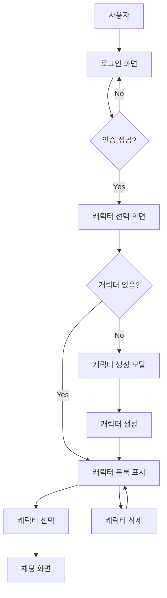

# 캐릭터 선택 서비스 아키텍처 문서

## 1. 개요

본 문서는 로그인 후 캐릭터 선택 화면을 제공하는 서비스의 아키텍처를 정의합니다. 사용자는 캐릭터를 생성, 선택, 삭제할 수 있으며, 선택한 캐릭터로 채팅 서비스를 이용할 수 있습니다.

### 1.1 주요 기능
- 로그인 후 캐릭터 선택 화면으로 자동 리다이렉트
- 캐릭터 생성 (이름, 성별 지정)
- 캐릭터 목록 조회
- 캐릭터 선택
- 캐릭터 삭제
- 선택한 캐릭터로 채팅 (현재는 에코 기능으로 구현)

### 1.2 기술 스택
- **Backend**: FastAPI, SQLAlchemy, PostgreSQL/SQLite
- **Frontend**: Vue 3, TypeScript, Pinia, Vue Router
- **Authentication**: JWT
- **API**: RESTful API

## 2. 시스템 아키텍처

### 2.1 전체 흐름도



### 2.2 컴포넌트 구조

```
Frontend (Vue 3)
├── Views
│   ├── LoginView.vue (기존)
│   ├── CharacterSelectionView.vue (신규)
│   └── ChatView.vue (수정)
├── Components
│   ├── CharacterCard.vue (신규)
│   ├── CharacterCreateModal.vue (신규)
│   └── CharacterDeleteModal.vue (신규)
├── Services
│   └── character.service.ts (수정)
└── Stores
    ├── auth.ts (기존)
    └── character.ts (신규)

Backend (FastAPI)
├── Models
│   └── character.py (수정 - gender 필드 추가)
├── Schemas
│   └── character.py (수정 - gender 필드 추가)
├── Routers
│   └── character.py (수정 - 선택 API 추가)
└── Services
    └── character_service.py (신규)
```

## 3. 데이터베이스 스키마

### 3.1 Character 테이블 (수정)

```sql
CREATE TABLE characters (
    id INTEGER PRIMARY KEY AUTOINCREMENT,
    name VARCHAR(100) NOT NULL,
    gender VARCHAR(20) NOT NULL,  -- 신규 필드
    system_prompt TEXT NOT NULL,
    description TEXT,
    created_by INTEGER NOT NULL,
    is_active BOOLEAN DEFAULT TRUE,  -- 신규 필드 (현재 선택된 캐릭터)
    created_at TIMESTAMP DEFAULT CURRENT_TIMESTAMP,
    updated_at TIMESTAMP,
    FOREIGN KEY (created_by) REFERENCES users(id)
);

-- 사용자당 하나의 활성 캐릭터만 가능하도록 인덱스 추가
CREATE UNIQUE INDEX idx_active_character_per_user 
ON characters(created_by, is_active) 
WHERE is_active = TRUE;
```

### 3.2 Chat 테이블 (수정 불필요)
기존 구조 유지 - character_id로 연결

## 4. API 설계

### 4.1 캐릭터 관련 API

#### 4.1.1 캐릭터 생성 (수정)
```http
POST /api/characters
Authorization: Bearer {token}
Content-Type: application/json

{
    "name": "string",
    "gender": "male|female|other",
    "system_prompt": "string",
    "description": "string (optional)"
}

Response:
{
    "id": 1,
    "name": "string",
    "gender": "string",
    "system_prompt": "string",
    "description": "string",
    "created_by": 1,
    "is_active": false,
    "created_at": "2024-01-01T00:00:00Z",
    "updated_at": null
}
```

#### 4.1.2 캐릭터 선택 (신규)
```http
POST /api/characters/{character_id}/select
Authorization: Bearer {token}

Response:
{
    "message": "Character selected successfully",
    "character": {
        "id": 1,
        "name": "string",
        "gender": "string",
        "is_active": true
    }
}
```

#### 4.1.3 현재 활성 캐릭터 조회 (신규)
```http
GET /api/characters/active
Authorization: Bearer {token}

Response:
{
    "id": 1,
    "name": "string",
    "gender": "string",
    "system_prompt": "string",
    "description": "string",
    "is_active": true
}
```

#### 4.1.4 캐릭터 목록 조회 (기존 유지)
```http
GET /api/characters
Authorization: Bearer {token}

Response:
{
    "characters": [
        {
            "id": 1,
            "name": "string",
            "gender": "string",
            "description": "string",
            "is_active": true,
            "created_at": "2024-01-01T00:00:00Z"
        }
    ],
    "total": 10,
    "skip": 0,
    "limit": 20
}
```

### 4.2 채팅 API (수정)

#### 4.2.1 채팅 메시지 전송 (에코 기능)
```http
POST /api/chat/messages
Authorization: Bearer {token}
Content-Type: application/json

{
    "message": "string",
    "character_id": 1  // 선택 사항, 없으면 활성 캐릭터 사용
}

Response:
{
    "id": 1,
    "chat_id": 1,
    "message": "string",  // 에코: 동일한 메시지 반환
    "is_user": false,
    "character_id": 1,
    "created_at": "2024-01-01T00:00:00Z"
}
```

## 5. Frontend 구현 상세

### 5.1 라우터 설정

```typescript
// router/index.ts
const routes = [
  {
    path: '/login',
    name: 'login',
    component: LoginView,
    meta: { requiresGuest: true }
  },
  {
    path: '/characters',
    name: 'character-selection',
    component: CharacterSelectionView,
    meta: { requiresAuth: true }
  },
  {
    path: '/chat',
    name: 'chat',
    component: ChatView,
    meta: { requiresAuth: true, requiresCharacter: true }
  }
]

// 네비게이션 가드
router.beforeEach((to, from, next) => {
  const authStore = useAuthStore()
  const characterStore = useCharacterStore()
  
  if (to.meta.requiresAuth && !authStore.isAuthenticated) {
    next('/login')
  } else if (to.meta.requiresCharacter && !characterStore.activeCharacter) {
    next('/characters')
  } else if (to.name === 'login' && authStore.isAuthenticated) {
    next('/characters')
  } else {
    next()
  }
})
```

### 5.2 Character Store (Pinia)

```typescript
// stores/character.ts
export const useCharacterStore = defineStore('character', {
  state: () => ({
    characters: [] as Character[],
    activeCharacter: null as Character | null,
    loading: false,
    error: null as string | null
  }),
  
  actions: {
    async fetchCharacters() {
      // 캐릭터 목록 조회
    },
    
    async createCharacter(data: CreateCharacterDto) {
      // 캐릭터 생성
    },
    
    async selectCharacter(characterId: number) {
      // 캐릭터 선택
    },
    
    async deleteCharacter(characterId: number) {
      // 캐릭터 삭제
    },
    
    async fetchActiveCharacter() {
      // 활성 캐릭터 조회
    }
  }
})
```

### 5.3 CharacterSelectionView 컴포넌트

```vue
<!-- views/CharacterSelectionView.vue -->
<template>
  <div class="character-selection">
    <h1>캐릭터 선택</h1>
    
    <!-- 캐릭터가 없을 때 -->
    <div v-if="!characters.length" class="empty-state">
      <p>생성된 캐릭터가 없습니다.</p>
      <button @click="showCreateModal = true">첫 캐릭터 만들기</button>
    </div>
    
    <!-- 캐릭터 목록 -->
    <div v-else class="character-grid">
      <CharacterCard
        v-for="character in characters"
        :key="character.id"
        :character="character"
        :is-active="character.is_active"
        @select="selectCharacter"
        @delete="confirmDelete"
      />
      
      <!-- 캐릭터 추가 카드 -->
      <div class="add-character-card" @click="showCreateModal = true">
        <span class="plus-icon">+</span>
        <span>새 캐릭터 만들기</span>
      </div>
    </div>
    
    <!-- 캐릭터 생성 모달 -->
    <CharacterCreateModal
      v-if="showCreateModal"
      @close="showCreateModal = false"
      @created="onCharacterCreated"
    />
    
    <!-- 캐릭터 삭제 확인 모달 -->
    <CharacterDeleteModal
      v-if="characterToDelete"
      :character="characterToDelete"
      @confirm="deleteCharacter"
      @cancel="characterToDelete = null"
    />
  </div>
</template>
```

## 6. Backend 구현 상세

### 6.1 Character Model 수정

```python
# models/character.py
from sqlalchemy import Column, Integer, String, Text, ForeignKey, DateTime, Boolean, Enum
from sqlalchemy.orm import relationship
from sqlalchemy.sql import func
import enum

class GenderEnum(str, enum.Enum):
    MALE = "male"
    FEMALE = "female"
    OTHER = "other"

class Character(Base):
    __tablename__ = "characters"
    
    id = Column(Integer, primary_key=True, index=True)
    name = Column(String(100), nullable=False, index=True)
    gender = Column(Enum(GenderEnum), nullable=False)  # 신규
    system_prompt = Column(Text, nullable=False)
    description = Column(Text, nullable=True)
    created_by = Column(Integer, ForeignKey("users.id"), nullable=False)
    is_active = Column(Boolean, default=False)  # 신규
    created_at = Column(DateTime(timezone=True), server_default=func.now())
    updated_at = Column(DateTime(timezone=True), onupdate=func.now())
    
    # Relationships
    creator = relationship("User", back_populates="created_characters")
    chats = relationship("Chat", back_populates="character", cascade="all, delete-orphan")
```

### 6.2 Character Schema 수정

```python
# schemas/character.py
from pydantic import BaseModel, Field
from typing import Optional
from datetime import datetime
from enum import Enum

class GenderEnum(str, Enum):
    male = "male"
    female = "female"
    other = "other"

class CharacterBase(BaseModel):
    name: str = Field(..., min_length=1, max_length=100)
    gender: GenderEnum  # 신규
    system_prompt: str = Field(..., min_length=1)
    description: Optional[str] = None

class CharacterCreate(CharacterBase):
    pass

class CharacterResponse(CharacterBase):
    id: int
    created_by: int
    is_active: bool  # 신규
    created_at: datetime
    updated_at: Optional[datetime] = None
    
    model_config = ConfigDict(from_attributes=True)
```

### 6.3 Character Router 수정

```python
# routers/character.py
from fastapi import APIRouter, Depends, HTTPException
from sqlalchemy.orm import Session
from typing import List

router = APIRouter(prefix="/api/characters", tags=["characters"])

@router.post("/{character_id}/select", response_model=dict)
async def select_character(
    character_id: int,
    db: Session = Depends(get_db),
    current_user: User = Depends(get_current_user)
):
    """캐릭터 선택 API"""
    # 1. 현재 사용자의 모든 캐릭터 is_active를 False로
    db.query(Character).filter(
        Character.created_by == current_user.id
    ).update({"is_active": False})
    
    # 2. 선택한 캐릭터를 active로 설정
    character = db.query(Character).filter(
        Character.id == character_id,
        Character.created_by == current_user.id
    ).first()
    
    if not character:
        raise HTTPException(status_code=404, detail="Character not found")
    
    character.is_active = True
    db.commit()
    
    return {
        "message": "Character selected successfully",
        "character": CharacterResponse.from_orm(character)
    }

@router.get("/active", response_model=CharacterResponse)
async def get_active_character(
    db: Session = Depends(get_db),
    current_user: User = Depends(get_current_user)
):
    """현재 활성 캐릭터 조회"""
    character = db.query(Character).filter(
        Character.created_by == current_user.id,
        Character.is_active == True
    ).first()
    
    if not character:
        raise HTTPException(status_code=404, detail="No active character found")
    
    return character
```

## 7. 보안 고려사항

### 7.1 인증 및 권한
- JWT 토큰 기반 인증 유지
- 사용자는 자신이 생성한 캐릭터만 조회, 수정, 삭제 가능
- 캐릭터 선택 시 소유권 검증

### 7.2 데이터 검증
- 캐릭터 이름 길이 제한 (1-100자)
- 성별 필드는 enum으로 제한
- SQL Injection 방지를 위한 ORM 사용

### 7.3 Rate Limiting
- 캐릭터 생성: 사용자당 분당 5회 제한
- API 호출: 사용자당 분당 100회 제한

## 8. 성능 최적화

### 8.1 캐싱
- 활성 캐릭터 정보를 Redis에 캐싱
- 캐릭터 목록 캐싱 (TTL: 5분)

### 8.2 데이터베이스 인덱싱
- created_by 필드에 인덱스 추가
- is_active와 created_by 복합 인덱스

### 8.3 Frontend 최적화
- 캐릭터 카드 컴포넌트 lazy loading
- 이미지 최적화 (추후 아바타 기능 추가 시)

## 9. 확장 계획

### 9.1 단기 계획
- 캐릭터 아바타 이미지 업로드
- 캐릭터별 대화 스타일 설정
- 캐릭터 검색 기능

### 9.2 장기 계획
- AI 모델별 캐릭터 특성 구현
- 캐릭터 공유 기능
- 캐릭터 템플릿 마켓플레이스

## 10. 테스트 전략

### 10.1 단위 테스트
- Character 모델 CRUD 테스트
- 캐릭터 선택 로직 테스트
- 권한 검증 테스트

### 10.2 통합 테스트
- 로그인 → 캐릭터 선택 → 채팅 플로우
- 캐릭터 생성/삭제 시나리오
- 동시성 테스트 (활성 캐릭터 유일성)

### 10.3 E2E 테스트
- Playwright를 이용한 전체 사용자 시나리오 테스트
- 다중 브라우저 호환성 테스트